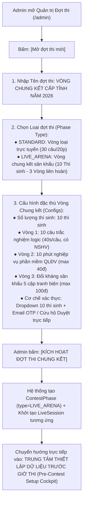
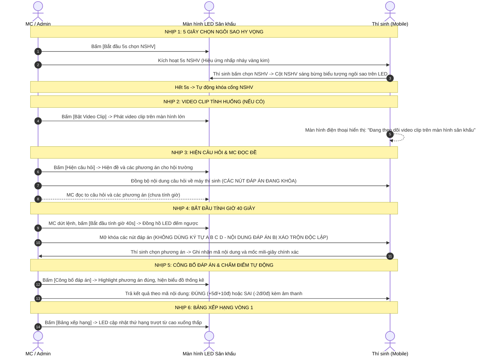

# KỊCH BẢN VẬN HÀNH & KẾ HOẠCH TRIỂN KHAI VÒNG CHUNG KẾT
## HỘI THI BÍ THƯ ĐOÀN CƠ SỞ GIỎI TỈNH NGHỆ AN NĂM 2026

> **Căn cứ pháp lý & Tài liệu nguồn:**
> - Kế hoạch số 435-KH/TĐTN-CTĐ&TTN của Ban Thường vụ Tỉnh đoàn Nghệ An.
> - Thể lệ Vòng thi cấp tỉnh ngày 28/9/2026 và Thể lệ Vòng Chung kết (`requirements/THỂ LỆ VÒNG CHUNG KẾT.docx`).
> - Danh sách 70 thí sinh đủ điều kiện thi Vòng loại cấp tỉnh (`requirements/Danh sách thí sinh đủ điều kiện thi vòng loại cấp tỉnh.xlsx`).
> - Kiến trúc Quản trị Đợt thi (`ContestPhase`) hiện hữu của hệ thống.

---

## PHẦN I: KIẾN TRÚC QUẢN TRỊ THEO ĐỢT THI (CONTEST PHASE ARCHITECTURE)
*(Đồng bộ toàn diện hệ sinh thái: Admin -> Trang chủ -> Thí sinh -> Màn hình LED)*

Hệ thống hoạt động theo nguyên tắc quản lý **Đợt thi trung tâm (`ContestPhase`)**. Mọi hành vi trên Trang chủ (`Landing.tsx`), Trang thi thí sinh và Bảng điều hành Admin đều phụ thuộc vào Đợt thi đang diễn ra (`status = ACTIVE`).

### 1. Luồng Admin Tạo & Cấu hình Đợt thi Vòng Chung kết:



### 2. Sự đồng bộ toàn hệ thống khi Đợt thi `LIVE_ARENA` kích hoạt:
- **Tại Trang chủ (`Landing.tsx`)**:
  + Nhận diện ngay đợt thi hiện tại là `LIVE_ARENA`.
  + Huy hiệu trạng thái trên Navbar đổi sang: **"VÒNG CHUNG KẾT CẤP TỈNH · ĐANG MỞ"**.
  + Nút CTA chính đổi thành **`[VÀO THI CHUNG KẾT]`** (dẫn thẳng vào `/live/play`).
  + Hiển thị phân đoạn trang trọng vinh danh **"10 GƯƠNG MẶT XUẤT SẮC BƯỚC VÀO VÒNG CHUNG KẾT"** với ảnh chân dung (Avatar), Họ tên, Chức vụ và Đơn vị.
  + Thể lệ hiển thị chi tiết 3 phần thi: Thông thái (Vòng 1), Nhạy bén (Vòng 2), Bản lĩnh (Vòng 3).
- **Tại Cổng thi thí sinh (`/live/play`)**:
  + Tự động kết nối vào phiên thi Chung kết của đợt thi đang mở.
  + Mở cổng điểm danh 2 lớp bảo mật (Dropdown 10 thí sinh + Email OTP / Cứu hộ Admin duyệt trực tiếp).
- **Tại Màn hình LED Sân khấu (`/live/screen`)**:
  + Hiển thị tiêu đề chính thức từ Đợt thi: *"HỘI THI BÍ THƯ ĐOÀN CƠ SỞ GIỎI TỈNH NGHỆ AN 2026 - VÒNG CHUNG KẾT CẤP TỈNH"*.

---

## PHẦN II: TRUNG TÂM THIẾT LẬP DỮ LIỆU TRƯỚC GIỜ THI (PRE-CONTEST SETUP COCKPIT)
*(Admin nhập và kiểm duyệt toàn bộ danh sách thí sinh và câu hỏi cả 3 vòng trước khi thi)*

### 1. Quản lý Danh sách Thí sinh (CRUD & Liên kết dữ liệu vòng loại):
- **Cơ chế nạp nhanh**:
  + **Nút `[Lấy nhanh Top 10 từ Vòng loại]`**: Tự động trích xuất 10 thí sinh điểm cao nhất từ bảng xếp hạng thi thực tế ngày 02/10/2026 (`findLeaderboard()`).
  + **Bảo lưu liên kết định danh (`contestantId`)**: Hệ thống lưu liên kết với hồ sơ gốc trong `contestants` và bài thi trong `exams`. Khi kết thúc hội thi, màn hình vinh danh sẽ truy xuất trọn vẹn chuỗi số liệu thi liên hoàn (Vòng sơ khảo, Vòng loại: điểm số, thời gian làm bài, số lượt thi) để vinh danh toàn diện hành trình của thí sinh.
- **Tính năng Thêm / Sửa / Xóa (CRUD Thí sinh)**:
  + **SBD**: Số báo danh chính thức trên sân khấu (01 đến 10).
  + **Họ và tên**: Tên đầy đủ của thí sinh.
  + **Đơn vị**: Huyện, Thị, Thành đoàn hoặc Đoàn trực thuộc.
  + **Chức vụ**: Bí thư / Phó Bí thư Đoàn cơ sở.
  + **Email**: Địa chỉ email chính thức dùng để nhận mã OTP đăng nhập trên điện thoại.
  + **Số điện thoại**: Dùng để liên lạc khẩn cấp.
  + **Ảnh chân dung (Avatar URL)**: Cập nhật link ảnh chân dung trang trọng của thí sinh (đồng bộ hiển thị ngay trên Trang chủ `Landing.tsx` và Màn hình LED sân khấu).
  + Cho phép thêm mới hoặc xóa bớt thí sinh trong trường hợp có thay đổi trước giờ thi.

### 2. Quản lý Bộ câu hỏi Vòng 1 ("Thông thái"):
- Gồm **10 câu hỏi logic** (có thể cấu hình thêm số lượng câu hỏi phụ khi bằng điểm).
- Mỗi câu hỏi bao gồm:
  + Thứ tự câu (Câu 01 đến Câu 10).
  + **Nội dung câu hỏi**: Dữ kiện logic, kiến thức công tác Đoàn, kinh tế - xã hội, pháp luật.
  + **Video clip tình huống (nếu có)**: Link video YouTube hoặc video file trực tiếp.
  + **4 Phương án lựa chọn**: Nội dung từng phương án.
  + **Phương án chính xác**: Xác định phương án chuẩn.
  + **Lời giải thích / Căn cứ pháp lý**: Trích dẫn văn bản, nghị quyết để hiện trên màn hình LED sau khi công bố kết quả.
  + **Thời gian làm bài**: Mặc định 40 giây.
  + **NGUYÊN TẮC KỸ THUẬT QUAN TRỌNG:** Tuyệt đối không dùng ký tự A B C D để làm căn cứ chấm điểm trên máy thí sinh. Mỗi phương án có mã định danh nội dung riêng (`contentKey` / `optionId`). Khi thí sinh gửi bài, hệ thống gửi mã định danh nội dung đã chọn để so khớp chính xác với đáp án chuẩn, loại trừ hoàn toàn việc nhìn bài hoặc phím đáp án theo chữ cái.

### 3. Quản lý Bộ đề thi Vòng 2 ("Nhạy bén"):
- Danh sách các mã đề thi nghiệp vụ thực hành trên phần mềm Quản lý đoàn viên (`ĐỀ 01`, `ĐỀ 02`, `ĐỀ 03`, `ĐỀ 04`, `ĐỀ 05`...).
- Mỗi mã đề bao gồm:
  + **Mã đề**: Ví dụ `ĐỀ 01`, `ĐỀ 02`...
  + **Tên chủ đề nghiệp vụ**: Ví dụ *"Nghiệp vụ chuyển sinh hoạt đoàn & đánh giá xếp loại đoàn viên"*.
  + **Tình huống 1** (Tối đa 20 điểm): Mô tả nghiệp vụ chi tiết cần thao tác trên phần mềm QLĐV.
  + **Tình huống 2** (Tối đa 20 điểm): Mô tả nghiệp vụ chi tiết cần thao tác trên phần mềm QLĐV.
  + **Đáp án & Hướng dẫn chấm điểm**: Dành cho Ban Giám khảo chấm điểm thực tế.

### 4. Quản lý Bộ chủ đề Vòng 3 ("Bản lĩnh"):
- Danh sách **05 chủ đề tranh biện đối kháng** cho 5 cặp đấu (kèm các chủ đề dự phòng):
  + **Mã chủ đề**: Chủ đề 01 đến 05.
  + **Tên chủ đề thực tiễn**: Tình huống thực tế công tác Đoàn cơ sở.
  + **Tình huống Giai đoạn 1 (Đề xuất phương án)**: Tình huống thực tiễn ban đầu (02 phút chuẩn bị, 05 phút trình bày).
  + **Tình huống Giai đoạn 2 (Giải quyết vấn đề)**: Diễn biến mới do Ban Giám khảo đưa ra (03 phút xử lý).
  + **Điểm tranh luận cốt lõi Giai đoạn 3 (Tầm nhìn thủ lĩnh)**: Điểm mấu chốt để 2 thí sinh tranh biện bảo vệ giải pháp tối ưu trong 01 phút.
  + **Tiêu chí & Thang điểm BGK**: Thang điểm 100 theo tiêu chí Ban Giám khảo.

---

## PHẦN III: KỊCH BẢN ĐĂNG NHẬP & PHÒNG CHỜ CỦA THÍ SINH (`/live/play`)
*(Bảo mật 2 lớp - Ngăn chặn 100% khán giả tự ý vào thi - Cơ chế Duyệt & Mời ra khỏi phòng)*

### 1. Luồng điểm danh trên thiết bị di động của thí sinh:
- **Bước 1: Chọn danh tính từ Dropdown**:
  + Thí sinh mở trang thi đấu `/live/play`.
  + Bấm vào Dropdown: Chỉ hiển thị danh sách các thí sinh chính thức do Admin đã nhập trước đó.
  + Khi chọn tên mình, hệ thống hiển thị Thẻ danh tính chính thức gồm SBD, Họ tên, Chức vụ, Đơn vị và Ảnh đại diện.
- **Bước 2: Xác thực danh tính**:
  + **Cách 1 - Chuẩn (Email OTP)**: Thí sinh nhập Email đã đăng ký -> Bấm *"Gửi mã xác thực OTP"* -> Nhận mã OTP 6 số qua email -> Nhập mã để vào phòng chờ.
  + **Cách 2 - Cứu hộ khẩn cấp sân khấu (Duyệt trực tiếp)**:
    - Khi hội trường nghẽn mạng 4G/Wifi hoặc email gửi chậm: Thí sinh bấm **`[Yêu cầu Ban Tổ chức Duyệt trực tiếp]`**.
    - Màn hình thí sinh chuyển sang trạng thái: *"ĐÃ GỬI YÊU CẦU! ĐANG CHỜ BAN TỔ CHỨC DUYỆT TRỰC TIẾP TRÊN SÂN KHẤU..."* (kèm radar sóng kết nối realtime).
    - Trên màn hình Admin (`/admin/live-control`): Thí sinh này sẽ nhấp nháy cờ đỏ `⚠️ YÊU CẦU DUYỆT`.
    - Admin đối chiếu thực tế thí sinh trên sân khấu và bấm nút: **`[Duyệt trực tiếp (Bypass)]`**.
    - Hệ thống lập tức kích hoạt điểm danh, màn hình điện thoại thí sinh tự động nhận tín hiệu WebSocket và chuyển thẳng vào sàn đấu mà không cần nhập OTP.
  + **Quyền hạn quản lý phòng chờ của Admin (Mời ra khỏi phòng)**:
    - Tại danh sách thí sinh trong phòng chờ, Admin có nút **`[Mời ra khỏi phòng / Reset]`** cho từng thí sinh.
    - Nếu có sự cố thiết bị hoặc điểm danh nhầm người, Admin bấm nút này để đưa thí sinh về trạng thái chưa điểm danh, lập tức đẩy thiết bị cũ về màn hình chọn danh tính ban đầu.

### 2. Cơ chế Điều khiển Nút Bắt đầu Vòng 1 tại Bàn Admin:
- **Trường hợp đủ người**: Khi toàn bộ 10/10 thí sinh đã điểm danh vào phòng chờ, nút **`[BẮT ĐẦU VÒNG 1 (THÔNG THÁI)]`** sẽ sáng bừng màu xanh nổi bật, thông báo hệ thống đã sẵn sàng 100%.
- **Trường hợp thiếu người (Test thử nghiệm hoặc sự cố bất khả kháng)**:
  + Nếu số lượng thí sinh điểm danh < 10: Nút bắt đầu **vẫn bấm được**.
  + Khi bấm, hệ thống lập tức bật **Popup cảnh báo xác nhận (Warning Confirm Modal)**:
    ```text
    ⚠️ CẢNH BÁO KỸ THUẬT: HIỆN CHỈ CÓ {count}/10 THÍ SINH ĐÃ ĐIỂM DANH!
    - Danh sách thí sinh chưa vào phòng chờ: [SBD 04 - Phạm Quỳnh Chi, SBD 07 - Đặng Quốc Tuấn...]
    - Bạn có chắc chắn muốn bắt đầu Vòng 1 ngay bây giờ không?
    (Lưu ý: Chỉ sử dụng khi diễn tập thử nghiệm hoặc có chỉ đạo đặc biệt từ Ban Tổ chức).
    [XÁC NHẬN VẪN BẮT ĐẦU THI]    [HỦY, TIẾP TỤC CHỜ]
    ```

---

## PHẦN IV: NOTE KỸ THUẬT: PHƯƠNG PHÁP BÙ TRỪ ĐỘ TRỄ MẠNG (PING / RTT COMPENSATION)
*(Đảm bảo tính công bằng tuyệt đối giữa các thiết bị di động trên sân khấu)*

Vòng 1 áp dụng cơ chế tính điểm giảm dần theo thời gian (01-10s: 5đ, 11-30s: 3đ, 31-40s: 2đ), do đó sự chênh lệch mạng 4G/Wifi giữa các dòng máy (ping từ 50ms đến 500ms) có thể ảnh hưởng đến kết quả nếu chỉ tính theo thời điểm gói tin bay tới máy chủ. Hệ thống áp dụng 4 lớp bù trừ kỹ thuật:

```mermaid
flowchart TD
    subgraph SYNC["1. ĐỒNG BỘ ĐỒNG HỒ (CLOCK OFFSET)"]
        S1["Đo RTT định kỳ via WebSocket"] --> S2["Tính ClockOffset = T_server - (T_client + RTT/2)"]
        S2 --> S3["Đồng hồ 40s trên máy thí sinh khớp 100% với màn hình LED"]
    end

    subgraph REACTION["2. TÍNH THỜI GIAN PHẢN HỒI THỰC TẾ (CLIENT REACTION TIME)"]
        R1["Khi mở khóa câu hỏi: T_start = performance.now()"] --> R2["Khi thí sinh chạm chọn: T_press = performance.now()"]
        R2 --> R3["Delta_t = T_press - T_start (Mili-giây phản hồi thực tế)"]
    end

    subgraph GRACE["3. NGƯỠNG ÂN HẠN ĐƯỜNG TRUYỀN (NETWORK GRACE PERIOD)"]
        G1["Server nhận gói tin"] --> G2{"Delta_t <= 40000ms\nvà Server_arrival <= 41000ms?"}
        G2 -->|Hợp lệ| G3["Chấm điểm theo Delta_t thực tế của thí sinh"]
        G2 -->|Quá giờ| G4["Tính 0 điểm (Hết giờ)"]
    end

    subgraph RESYNC["4. TỰ ĐỘNG RECONNECT & SNAPSHOT RESYNC"]
        C1["Nếu rớt mạng 4G/Wifi"] --> C2["Auto-reconnect trong 1.5s"]
        C2 --> C3["Tự kéo lại Snapshot câu hỏi hiện tại từ Server"]
    end
```



1. **Đồng bộ sai lệch đồng hồ (Clock Offset Synchronization - SNTP mini)**:
   - Khi thiết bị kết nối, client và server trao đổi gói tin timestamp để đo RTT:
     $$\text{RTT} = t_{\text{client\_receive}} - t_{\text{client\_send}}$$
     $$\text{ClockOffset} = t_{\text{server}} - \left(t_{\text{client\_send}} + \frac{\text{RTT}}{2}\right)$$
   - Đồng hồ đếm ngược 40 giây trên máy thí sinh chạy theo giờ đồng bộ của Server, trùng khớp 100% với đồng hồ trên Màn hình LED sân khấu.

2. **Ghi nhận thời gian phản hồi thực tế tại Client (`performance.now()`)**:
   - Ngay khoảnh khắc nhận sự kiện `QUESTION_STARTED` và mở khóa các nút phương án: Client lưu `startTime = performance.now()`.
   - Ngay khoảnh khắc ngón tay thí sinh chạm vào phương án: Client lưu `pressTime = performance.now()`.
   - Thời gian làm bài thực tế:
     $$\text{responseTimeMs} = \text{Math.round}(\text{pressTime} - \text{startTime})$$
   - Payload gửi lên Server gồm: `{ selectedKey, responseTimeMs, clientTimestamp }`.

3. **Ngưỡng ân hạn độ trễ mạng (Network Grace Period - 1.000 ms)**:
   - Khi đồng hồ 40s kết thúc trên Server, Server mở một khoảng thời gian ân hạn là **1.000 ms (1 giây)** cho các gói tin đang bay trên đường truyền mạng.
   - Nếu thí sinh bấm trước giây 40 (`responseTimeMs <= 40000`) và gói tin đến Server trong ngưỡng ân hạn: Bài làm **hợp lệ 100%**, Server tính điểm dựa trên đúng `responseTimeMs` thực tế của thí sinh.

4. **Tự phục hồi kết nối & Đồng bộ trạng thái (Auto-Reconnect & State Resync)**:
   - Nếu kết nối mạng bị gián đoạn chốc lát, thư viện WebSocket tự động tái kết nối trong vòng 1.5 giây.
   - Ngay khi có mạng trở lại, client tự động gọi API `/api/live/session/active` để lấy lại trạng thái câu hỏi hiện tại, bảo đảm thí sinh không bị mất quyền thi đấu.

---

## PHẦN V: KỊCH BẢN CHI TIẾT ĐIỀU HÀNH 3 VÒNG THI TRÊN SÂN KHẤU

### 1. Vòng 1: "Bí thư đoàn cơ sở - Thông thái" (10 câu hỏi)
- **Quy định**: 10 câu hỏi logic, 40 giây/câu.
- **Thang điểm**: 01-10s: **5 điểm**, 11-30s: **3 điểm**, 31-40s: **2 điểm**, Sai/Hết giờ: **0 điểm**.
- **Ngôi sao hy vọng (NSHV)**: Sử dụng duy nhất 1 lần trong 10 câu. Đúng x2 điểm, Sai trừ 2 điểm.



### 2. Vòng 2: "Bí thư đoàn cơ sở - Nhạy bén" (Nghiệp vụ phần mềm QLĐV)
- **Hiển thị trung tâm công khai**:
  + Khi thí sinh bốc thăm mã đề, Admin chọn Thí sinh và Mã đề trên bàn điều khiển (ví dụ `Thí sinh Nguyễn Văn An` -> `ĐỀ 02`).
  + **Màn hình LED trung tâm lập tức cập nhật bảng theo dõi công khai**: Cả hội trường và Ban Giám khảo nhìn thấy rõ thí sinh nào đang thi mã đề nào.
- **Kích hoạt câu hỏi thi đấu**:
  + Trên bàn Admin có nút riêng: **`[HIỂN THỊ CÂU HỎI MÃ ĐỀ]`**.
  + Khi thí sinh bắt đầu 10 phút làm bài, Admin bấm nút này: Toàn bộ nội dung 2 tình huống nghiệp vụ của mã đề đó mới bung ra rõ ràng trên màn hình LED lớn để hội trường cùng theo dõi thí sinh thao tác trên máy tính.
- **Chấm điểm**: Ban Giám khảo chấm điểm tình huống 1 (max 20đ) và tình huống 2 (max 20đ). Admin nhập điểm trực tiếp vào hệ thống -> Điểm tự động cộng dồn lên Bảng xếp hạng.

### 3. Vòng 3: "Bí thư đoàn cơ sở - Bản lĩnh" (Tranh biện đối kháng 5 cặp)
- **Quay số ghép cặp ngẫu nhiên trực tiếp trên sân khấu**:
  + Admin bấm nút `[Bốc thăm ngẫu nhiên]`.
  + Màn hình LED sân khấu chạy hiệu ứng ngẫu nhiên quay số / ghép 10 thí sinh thành 05 cặp đấu đối kháng trước sự chứng kiến minh bạch của hội trường.
- **Tiến trình 3 giai đoạn**:
  + Giai đoạn 1: Đề xuất phương án (02 phút chuẩn bị, 05 phút trình bày; quá 15s trừ 5đ).
  + Giai đoạn 2: Giải quyết vấn đề (03 phút xử lý tình huống phát sinh do BGK đưa ra).
  + Giai đoạn 3: Tầm nhìn Thủ lĩnh (01 phút bảo vệ giải pháp tối ưu).
- **Chấm điểm**: Ban Giám khảo chấm tối đa 100 điểm. Admin nhập điểm trung bình BGK -> Hệ thống tổng hợp toàn diện cả 3 vòng.

### 4. Tổng kết & Vinh danh Trao giải:
- Tự động xếp thứ hạng theo tổng điểm: **01 Quán quân (Giải Nhất)**, **03 Giải Nhì**, **06 Giải Ba**.
- Màn hình LED kích hoạt bục Podium vinh danh trang trọng, nhạc hiệu chiến thắng và hiệu ứng pháo hoa.
- **Hiển thị số liệu toàn diện**: Nhờ bảo lưu `contestantId`, hồ sơ vinh danh hiển thị trọn vẹn hành trình từ Vòng sơ khảo, kết quả Vòng loại đến thành tích Vòng Chung kết của từng thí sinh.

---

## PHẦN VI: THIẾT KẾ MỸ THUẬT & QUY CHUẨN NGÔN NGỮ

1. **Chuẩn nhận diện Đoàn TNCS Hồ Chí Minh**:
   - Màu sắc chủ đạo: Xanh dương Đoàn thanh niên (`#10348c`, `#1746b8`, `#0d2d6e`), Đỏ cờ Tổ quốc (`#dc2626`), Vàng sao vàng (`#facc15`).
   - Phông chữ mã nguồn mở tiếng Việt chuẩn mực: `Be Vietnam Pro` / `Inter`, kích thước rõ ràng, độ tương phản cao, chống lóa trên màn hình LED lớn và tối ưu trên màn hình di động.

2. **Quy chuẩn ngôn ngữ & phong cách thông báo kỹ thuật**:
   - **Tuyệt đối không dùng từ "Đồng chí"** trong các thông báo hệ thống và giao diện.
   - Sử dụng thống nhất danh xưng: **"Thí sinh"**, **"Ban Tổ chức"**, **"Ban Giám khảo"**.
   - Giọng văn kỹ thuật, dứt khoát, chính xác, nghiêm túc:
     + *"Vui lòng chọn tên thí sinh để đăng nhập"*
     + *"Xác thực danh tính thí sinh qua mã OTP"*
     + *"Mã OTP đã được gửi đến email cá nhân của thí sinh"*
     + *"Thí sinh đã vào phòng chờ thành công"*
     + *"Bắt đầu tính giờ 40 giây"*
     + *"Cảnh báo kỹ thuật: Số lượng thí sinh điểm danh chưa đủ 10 người"*

3. **Đồng bộ khối 10 Gương mặt xuất sắc lên Trang chủ (`Landing.tsx`)**:
   - Hiển thị phân đoạn trang trọng: **"10 GƯƠNG MẶT XUẤT SẮC BƯỚC VÀO VÒNG CHUNG KẾT CẤP TỈNH"**.
   - 10 thẻ thí sinh hiển thị ảnh chân dung (Avatar), SBD (01 - 10), Họ và tên, Chức vụ và Đơn vị Đoàn cơ sở.
   - Nút liên kết chuyển nhanh: `[Vào Sàn đấu Thí sinh]` (`/live/play`) và `[Màn hình LED Sân khấu]` (`/live/screen`).

---

## PHẦN VII: KẾ HOẠCH TRIỂN KHAI THEO CÁC BƯỚC CỤ THỂ

| Bước | Hạng mục thực hiện | Nội dung chi tiết | Trạng thái |
| :---: | :--- | :--- | :---: |
| **B1** | **Trình duyệt Kịch bản & Kế hoạch** | Trình duyệt Kế hoạch triển khai & Kịch bản chi tiết đã tiếp thu 100% các ý kiến chỉ đạo. | **HOÀN THÀNH** |
| **B2** | **Nâng cấp Cấu hình Đợt thi (`ContestPhase`)** (`AdminDashboard.tsx` & Backend) | Cho phép chọn loại đợt thi: `STANDARD` (Vòng loại) vs `LIVE_ARENA` (Vòng chung kết). Tự động liên kết `live_sessions`. | Sẵn sàng triển khai |
| **B3** | **Xây dựng Phân hệ Nhập liệu Trước thi (Pre-Contest Setup)** (`AdminLiveControl.tsx` & Backend) | 1. Quản lý danh sách 10 thí sinh (CRUD, SBD, Tên, Đơn vị, Chức vụ, Email, SĐT, Avatar, giữ liên kết `contestantId`).<br>2. Quản lý 10 câu hỏi Vòng 1 (Nội dung, video, 4 phương án, đáp án đúng theo mã nội dung).<br>3. Quản lý bộ đề Vòng 2 (Mã đề, TH1, TH2).<br>4. Quản lý bộ chủ đề Vòng 3 (Chủ đề 01-05). | Sẵn sàng triển khai |
| **B4** | **Xây dựng Cổng Đăng nhập & Phòng chờ Thí sinh** (`LivePlayerMobile.tsx`) | 1. Giao diện xanh Đoàn trang trọng.<br>2. Dropdown chọn danh tính từ danh sách thí sinh.<br>3. Xác thực Email OTP chính chủ.<br>4. Yêu cầu Duyệt trực tiếp & Màn hình chờ duyệt (Bỏ cấp OTP, có nút Mời ra khỏi phòng).<br>5. Bù trừ độ trễ mạng (Clock sync + Client responseTimeMs + Grace period 1s). | Sẵn sàng triển khai |
| **B5** | **Hoàn thiện Điều hành Sân khấu & Màn hình LED** (`AdminLiveControl.tsx` & `LiveScreenHost.tsx`) | 1. Nút bắt đầu sáng khi đủ 10 người; popup warning khi thiếu người.<br>2. 6 Nhịp Vòng 1 (không dùng ABCD chấm điểm, xáo trộn nội dung độc lập).<br>3. Vòng 2: LED hiển thị thí sinh nào mã đề nào, nút [Hiển thị câu hỏi mã đề].<br>4. Vòng 3: Quay số ngẫu nhiên trực quan và nhập điểm BGK.<br>5. Màn hình Podium vinh danh tổng hợp toàn diện. | Sẵn sàng triển khai |
| **B6** | **Đồng bộ Trang chủ** (`Landing.tsx`) | Tự động nhận diện Đợt thi `LIVE_ARENA`, hiển thị 10 gương mặt thí sinh xuất sắc (Avatar, Họ tên, Chức vụ, Đơn vị) và Thể lệ 3 vòng thi. | Sẵn sàng triển khai |
| **B7** | **Kiểm thử liên hoàn & Diễn tập tổng thể** | Diễn tập toàn bộ kịch bản từ A-Z theo đúng quy trình. | Sẵn sàng triển khai |

---
*Tài liệu được lưu trữ chính thức tại thư mục `docs/` của dự án.*
