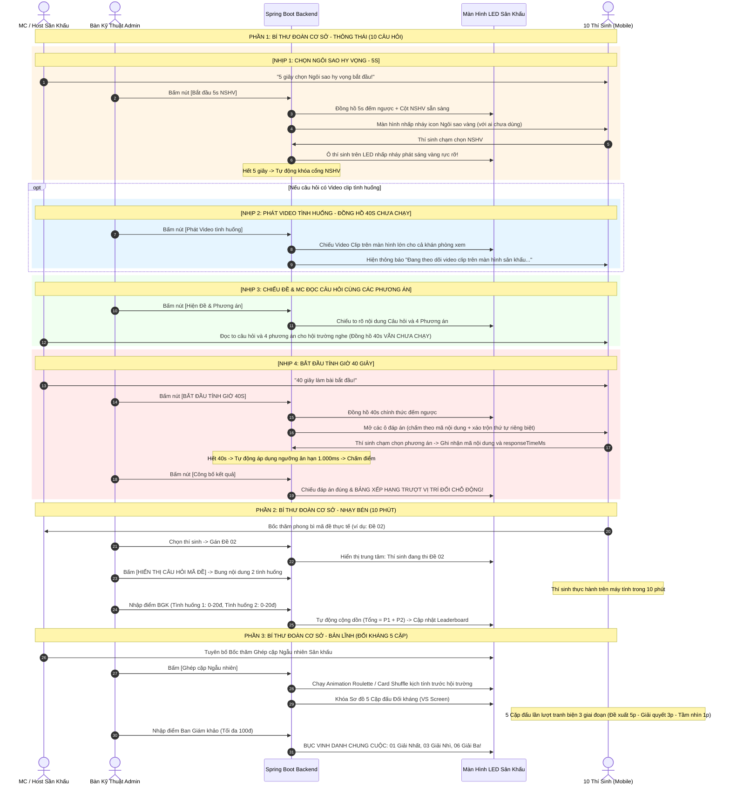

# BẢN BLUEPRINT THIẾT KẾ & ĐIỀU HÀNH VÒNG CHUNG KẾT SÂN KHẤU
## HỘI THI BÍ THƯ ĐOÀN CƠ SỞ GIỎI TỈNH NGHỆ AN 2026
*(Thể thức: Live Arena / Sân khấu tương tác thời gian thực – Chuẩn hóa theo Thể lệ Vòng Chung kết mới nhất của Ban Thường vụ Tỉnh đoàn)*

---

## MỤC LỤC
1. [Bảng So sánh & Đối chiếu Thể lệ Chính thức vs Blueprint](#i-bảng-so-sánh--đối-chiếu-thể-lệ-chính-thức-vs-blueprint)
2. [Tổng quan Kiến trúc & Nguyên tắc Hệ thống](#ii-tổng-quan-kiến-trúc--nguyên-tắc-hệ-thống)
3. [Vòng 1: Bí thư Đoàn cơ sở – Thông thái (Live Arena 10 câu hỏi)](#iii-vòng-1-bí-thư-đoàn-cơ-sở--thông-thái)
4. [Note Kỹ thuật: Thuật toán Bù trừ Độ trễ Mạng (Ping / RTT Compensation)](#iv-note-kỹ-thuật-thuật-toán-bù-trừ-độ-trễ-mạng-ping--rtt-compensation)
5. [Vòng 2: Bí thư Đoàn cơ sở – Nhạy bén (Thực hành QLĐV 10 phút & Nhập điểm Giám khảo)](#v-vòng-2-bí-thư-đoàn-cơ-sở--nhạy-bén)
6. [Vòng 3: Bí thư Đoàn cơ sở – Bản lĩnh (Ghép cặp Ngẫu nhiên Sân khấu & Đối kháng 3 Giai đoạn)](#vi-vòng-3-bí-thư-đoàn-cơ-sở--bản-lĩnh)
7. [Cơ cấu Giải thưởng & Bục Vinh danh](#vii-cơ-cấu-giải-thưởng--bục-vinh-danh)
8. [Thiết kế Cơ sở dữ liệu (Flyway Schema)](#viii-thiết-kế-cơ-sở-dữ-liệu-flyway-schema)
9. [Thiết kế Giao thức Realtime (WebSocket STOMP & REST API)](#ix-thiết-kế-giao-thức-realtime-websocket-stomp--rest-api)
10. [Kịch bản Điều hành Sân khấu Chi tiết (MC & Admin Runbook)](#x-kịch-bản-điều-hành-sân-khấu-chi-tiết)

---

## I. BẢNG SO SÁNH & ĐỐI CHIẾU THỂ LỆ CHÍNH THỨC VS BLUEPRINT

| Hạng mục | Văn bản "THỂ LỆ VÒNG CHUNG KẾT.docx" (Tỉnh đoàn Nghệ An) | Bản Thiết kế Kỹ thuật Blueprint (Hệ thống phần mềm) | Trạng thái đồng bộ |
| :--- | :--- | :--- | :---: |
| **Đối tượng dự thi** | 10 thí sinh đạt kết quả cao nhất tại Vòng loại (tổ chức ngày 02/10/2026 tại phường Trường Vinh). | Kế thừa hồ sơ từ bảng `contestants`, `eligible_contestants`, bảo lưu `contestantId` để liên kết trọn vẹn số liệu thi từ Vòng sơ khảo, Vòng loại. | ✅ 100% Khớp |
| **Vòng 1: Số lượng câu & thời gian** | 10 câu hỏi logic. Thời gian cho mỗi câu là 40 giây. | 10 câu hỏi. Đồng hồ 40s đếm ngược, hỗ trợ video clip tình huống YouTube / Upload file. | ✅ 100% Khớp |
| **Vòng 1: Thang điểm** | 01-10s: 5 điểm; 11-30s: 3 điểm; 31-40s: 2 điểm. Sai: 0 điểm. | Chuẩn hóa theo mốc thời gian của Server, áp dụng thuật toán bù trễ mạng (Ping/RTT và Clock Offset). | ✅ 100% Khớp |
| **Vòng 1: Ngôi sao hy vọng (NSHV)** | Chọn trước khi bắt đầu câu. Đúng x2 điểm, Sai -2 điểm. Mỗi người dùng tối đa 1 lần. | Quy trình 5s đếm ngược: Mobile nhấp nháy NSHV vàng kim $\rightarrow$ Màn hình LED highlight phát sáng rực rỡ. | ✅ 100% Khớp |
| **Vòng 1: Quy trình đọc đề & làm bài** | Thí sinh trả lời câu hỏi sau khi có hiệu lệnh. | **Quy trình 6 nhịp:** (1) Chọn NSHV 5s $\rightarrow$ (2) Chiếu video $\rightarrow$ (3) Chiếu đề & MC đọc câu hỏi cùng các đáp án $\rightarrow$ (4) Bấm tính giờ 40s $\rightarrow$ (5) Công bố đáp án $\rightarrow$ (6) Bảng xếp hạng. | ✅ Nâng cấp kịch bản thực tế |
| **Vòng 1: Chống nhìn bài** | Các phương án lựa chọn trên máy tính/thiết bị. | Hiển thị trực tiếp các khối nội dung đáp án; **tuyệt đối không dùng ký tự A B C D để chấm điểm trên máy thí sinh**; xáo trộn thứ tự phương án ngẫu nhiên độc lập cho từng người. | ✅ Nâng cấp vượt trội |
| **Vòng 2: Thời gian thi** | **10 phút** (trực tiếp trên phần mềm Quản lý đoàn viên). | Đồng hồ đếm ngược **10 phút**. | ✅ Đã cập nhật đúng Thể lệ mới |
| **Vòng 2: Đề thi & Tính điểm** | Bốc thăm 01 đề (02 tình huống nghiệp vụ QLĐV). Đúng mỗi tình huống 20đ $\rightarrow$ Tối đa 40 điểm. | Admin nhập ngân hàng đề (Mã đề + 2 Tình huống). Thí sinh bốc thăm $\rightarrow$ Admin chọn mã đề $\rightarrow$ Màn hình LED trung tâm hiển thị công khai thí sinh nào mã đề nào $\rightarrow$ Nút [Hiển thị câu hỏi mã đề] khi bắt đầu thi $\rightarrow$ Nhập điểm BGK. | ✅ 100% Khớp |
| **Vòng 3: Ghép cặp đối kháng** | 10 thí sinh chia thành 05 cặp thi đấu đối kháng bằng hình thức **Bốc thăm**. | Tính năng **Live Random Pairing**: Animation Roulette / Card Shuffle ngẫu nhiên trực tiếp trên màn hình LED công khai trước toàn thể hội trường. | ✅ 100% Khớp |
| **Vòng 3: 3 Giai đoạn thi đấu** | GĐ1: Đề xuất (2p chuẩn bị, 5p trình bày, quá 15s trừ 5đ); GĐ2: Giải quyết (3p); GĐ3: Tầm nhìn (1p). | Màn hình LED Versus (VS) hiển thị Avatar 2 thí sinh, tích hợp bộ đếm giờ riêng biệt cho từng giai đoạn. | ✅ 100% Khớp |
| **Vòng 3: Thang điểm** | Tối đa 100 điểm (Trung bình cộng BGK, làm tròn 0.5đ). | Thư ký nhập điểm BGK trực tiếp vào hệ thống. | ✅ 100% Khớp |
| **Cơ cấu giải thưởng** | **01 Giải Nhất**, **03 Giải Nhì**, **06 Giải Ba** + Giấy chứng nhận (Tổng 10 giải cho Top 10). | Bục vinh danh và Dashboard tổng kết hiển thị chuẩn: 01 Nhất, 03 Nhì, 06 Ba kèm ảnh Avatar và thống kê trọn vẹn hành trình. | ✅ 100% Khớp văn bản mới |

---

## II. TỔNG QUAN KIẾN TRÚC & NGUYÊN TẮC HỆ THỐNG

### 1. Kiến trúc Quản trị Đợt thi (`ContestPhase`)
* **Đợt thi trung tâm:** Admin tạo đợt thi mới với tên *"VÒNG CHUNG KẾT CẤP TỈNH NĂM 2026"*, loại hình `LIVE_ARENA`.
* **Kế thừa & Bảo tồn:** Dữ liệu Vòng loại cũ được bảo toàn 100%. Hệ thống liên kết tự động qua `contestantId` để lấy đầy đủ Họ tên, Đơn vị, chức vụ, điểm số và số lượt thi từ các vòng trước phục vụ vinh danh tổng kết.

### 2. Xác thực 2 Lớp & Cứu hộ Duyệt trực tiếp
* Thí sinh truy cập trang thi `/live/play`:
  1. Chọn tên mình từ Dropdown 10 thí sinh chính thức.
  2. Cách 1 (Chuẩn): Nhập Email đã đăng ký $\rightarrow$ Nhận OTP 6 số qua Email $\rightarrow$ Nhập xác thực.
  3. Cách 2 (Cứu hộ): Nếu gặp sự cố mạng/email, bấm *"Yêu cầu Ban Tổ chức Duyệt trực tiếp"*. Admin trên bàn điều khiển chỉ cần bấm **`[Duyệt trực tiếp (Bypass)]`** (1-click) để thí sinh vào sàn đấu ngay lập tức mà không cần OTP.
* **Quyền mời ra khỏi phòng:** Admin có nút **`[Mời ra khỏi phòng / Reset]`** để đưa thí sinh về trạng thái chưa điểm danh nếu có sự cố thiết bị hoặc điểm danh nhầm.
* Khán giả bên ngoài tuyệt đối không thể tự ý bấm vào thi.

### 3. Cơ chế Khởi động Phòng chờ
* Khi đủ 10/10 thí sinh điểm danh vào phòng chờ, nút **`[BẮT ĐẦU VÒNG 1 (THÔNG THÁI)]`** sẽ sáng bừng màu xanh sẵn sàng.
* Nếu chưa đủ 10 người (test thử nghiệm hoặc trường hợp đặc biệt), nút vẫn bấm được nhưng xuất hiện Popup cảnh báo xác nhận (Warning Confirm Modal) yêu cầu Admin phê duyệt trước khi bắt đầu.

---

## III. VÒNG 1: BÍ THƯ ĐOÀN CƠ SỞ – THÔNG THÁI
*(10 câu hỏi logic · 40 giây/câu · Tính điểm giảm dần · Ngôi sao hy vọng)*

### 1. Hiển thị Nội dung Đáp án & Xáo trộn Ngẫu nhiên trên Mobile
* **Tuyệt đối không dùng ký tự A B C D để chấm điểm trên máy thí sinh:**
  * Màn hình điện thoại hiển thị các khối nội dung đáp án rõ ràng.
  * Mỗi phương án có mã định danh nội dung riêng (`contentKey` / `optionId`).
  * Khi thí sinh chạm chọn, mã nội dung được gửi về máy chủ để so khớp chính xác với đáp án chuẩn.
* **Xáo trộn phương án độc lập cho từng người (Per-Contestant Shuffle):**
  * Thứ tự hiển thị các khối đáp án bị xáo trộn ngẫu nhiên độc lập giữa các máy thí sinh. Thí sinh ngồi cạnh nhau có vị trí đáp án hoàn toàn khác nhau, triệt tiêu 100% việc liếc nhìn thao tác của nhau.

### 2. Quy trình Chọn Ngôi sao Hy vọng (NSHV) 5 Giây
1. MC thông báo: *"5 giây quyết định chọn Ngôi sao hy vọng bắt đầu!"* $\rightarrow$ Admin bấm **`[Bắt đầu 5s chọn NSHV]`**.
2. Thiết bị thí sinh: Nếu chưa từng dùng NSHV, màn hình nhấp nháy nút Ngôi sao vàng kim (Pulse effect) kèm đồng hồ 5s. Thí sinh chạm chọn $\rightarrow$ Nút khóa, hiện badge kích hoạt NSHV.
3. Màn hình LED Sân khấu: Thí sinh nào chọn NSHV, ô của thí sinh đó phát sáng hào quang vàng rực rỡ kèm âm thanh kịch tính.
4. Hết 5 giây: Tự động khóa cổng NSHV trên toàn bộ thiết bị.

### 3. Kịch bản Điều hành Đọc đề Chuẩn xác
* **Nhịp 1 (Kích hoạt NSHV - 5s):** Thí sinh quyết định chọn NSHV trong 5s.
* **Nhịp 2 (Chiếu Video tình huống - nếu có):** Admin bấm phát video clip trên màn hình lớn. Đồng hồ 40s **CHƯA CHẠY**. Máy thí sinh hiển thị: *"Đang theo dõi video clip trên màn hình sân khấu..."*.
* **Nhịp 3 (Chiếu Đề & MC Đọc Câu hỏi cùng các Phương án):** Admin bấm hiện đề. MC đọc to câu hỏi và các phương án. Đồng hồ 40s **VẪN CHƯA CHẠY**, các nút đáp án trên máy thí sinh đang bị **KHÓA**.
* **Nhịp 4 (Bắt đầu Tính giờ 40 giây):** MC dứt lệnh $\rightarrow$ Admin bấm **`[BẮT ĐẦU TÍNH GIỜ 40S]`**. Đồng hồ đếm ngược trên LED và mở khóa các nút đáp án trên máy thí sinh. Thí sinh chạm chọn phương án.
* **Nhịp 5 (Công bố Đáp án & Chấm điểm):** Hết 40s, Admin bấm công bố đáp án. Màn hình LED highlight đáp án đúng, hiện biểu đồ thống kê. Máy thí sinh thông báo kết quả (Đúng: +5đ/+10đ, Sai: -2đ/0đ).
* **Nhịp 6 (Bảng xếp hạng):** Admin bấm hiện bảng xếp hạng. LED cập nhật thứ hạng trượt động từ cao xuống thấp.

---

## IV. NOTE KỸ THUẬT: THUẬT TOÁN BÙ TRỪ ĐỘ TRỄ MẠNG (PING / RTT COMPENSATION)
*(Đảm bảo tính công bằng tuyệt đối giữa các thiết bị di động trên sân khấu)*

Vòng 1 áp dụng cơ chế tính điểm giảm dần theo thời gian (01-10s: 5đ, 11-30s: 3đ, 31-40s: 2đ), do đó sự chênh lệch mạng 4G/Wifi giữa các dòng máy (ping từ 50ms đến 500ms) có thể ảnh hưởng đến kết quả nếu chỉ tính theo thời điểm gói tin bay tới máy chủ. Hệ thống áp dụng 4 lớp bù trừ kỹ thuật:

```mermaid
flowchart TD
    subgraph SYNC["1. ĐỒNG BỘ ĐỒNG HỒ (CLOCK OFFSET)"]
        S1["Đo RTT định kỳ via WebSocket"] --> S2["Tính ClockOffset = T_server - (T_client + RTT/2)"]
        S2 --> S3["Đồng hồ 40s trên máy thí sinh khớp 100% với màn hình LED"]
    end

    subgraph REACTION["2. TÍNH THỜI GIAN PHẢN HỒI THỰC TẾ (CLIENT REACTION TIME)"]
        R1["Khi mở khóa câu hỏi: T_start = performance.now()"] --> R2["Khi thí sinh chạm chọn: T_press = performance.now()"]
        R2 --> R3["Delta_t = T_press - T_start (Mili-giây phản hồi thực tế)"]
    end

    subgraph GRACE["3. NGƯỠNG ÂN HẠN ĐƯỜNG TRUYỀN (NETWORK GRACE PERIOD)"]
        G1["Server nhận gói tin"] --> G2{"Delta_t <= 40000ms\nvà Server_arrival <= 41000ms?"}
        G2 -->|Hợp lệ| G3["Chấm điểm theo Delta_t thực tế của thí sinh"]
        G2 -->|Quá giờ| G4["Tính 0 điểm (Hết giờ)"]
    end

    subgraph RESYNC["4. TỰ ĐỘNG RECONNECT & SNAPSHOT RESYNC"]
        C1["Nếu rớt mạng 4G/Wifi"] --> C2["Auto-reconnect trong 1.5s"]
        C2 --> C3["Tự kéo lại Snapshot câu hỏi hiện tại từ Server"]
    end
```



1. **Đồng bộ sai lệch đồng hồ (Clock Offset Synchronization - SNTP mini)**:
   - Khi thiết bị kết nối, client và server trao đổi gói tin timestamp để đo RTT:
     $$\text{RTT} = t_{\text{client\_receive}} - t_{\text{client\_send}}$$
     $$\text{ClockOffset} = t_{\text{server}} - \left(t_{\text{client\_send}} + \frac{\text{RTT}}{2}\right)$$
   - Đồng hồ đếm ngược 40 giây trên máy thí sinh chạy theo giờ đồng bộ của Server, trùng khớp 100% với đồng hồ trên Màn hình LED sân khấu.

2. **Ghi nhận thời gian phản hồi thực tế tại Client (`performance.now()`)**:
   - Ngay khoảnh khắc nhận sự kiện `QUESTION_STARTED` và mở khóa các nút phương án: Client lưu `startTime = performance.now()`.
   - Ngay khoảnh khắc ngón tay thí sinh chạm vào phương án: Client lưu `pressTime = performance.now()`.
   - Thời gian làm bài thực tế:
     $$\text{responseTimeMs} = \text{Math.round}(\text{pressTime} - \text{startTime})$$
   - Payload gửi lên Server gồm: `{ selectedKey, responseTimeMs, clientTimestamp }`.

3. **Ngưỡng ân hạn độ trễ mạng (Network Grace Period - 1.000 ms)**:
   - Khi đồng hồ 40s kết thúc trên Server, Server mở một khoảng thời gian ân hạn là **1.000 ms (1 giây)** cho các gói tin đang bay trên đường truyền mạng.
   - Nếu thí sinh bấm trước giây 40 (`responseTimeMs <= 40000`) và gói tin đến Server trong ngưỡng ân hạn: Bài làm **hợp lệ 100%**, Server tính điểm dựa trên đúng `responseTimeMs` thực tế của thí sinh.

4. **Tự phục hồi kết nối & Đồng bộ trạng thái (Auto-Reconnect & State Resync)**:
   - Nếu kết nối mạng bị gián đoạn chốc lát, thư viện WebSocket tự động tái kết nối trong vòng 1.5 giây.
   - Ngay khi có mạng trở lại, client tự động gọi API `/api/live/session/active` để lấy lại trạng thái câu hỏi hiện tại, bảo đảm thí sinh không bị mất quyền thi đấu.

---

## V. VÒNG 2: BÍ THƯ ĐOÀN CƠ SỞ – NHẠY BÉN
*(Thực hành Nghiệp vụ Phần mềm Quản lý đoàn viên · Thời gian: 10 phút · Bốc thăm Mã đề)*

### 1. Quản lý Ngân hàng Đề thi trên Hệ thống
* Admin nhập danh sách Mã đề (`ĐỀ 01`, `ĐỀ 02`,...) gồm:
  * Tình huống 1: Nghiệp vụ thực hiện (Tối đa: 20 điểm).
  * Tình huống 2: Nghiệp vụ phát sinh (Tối đa: 20 điểm).
  * Tổng điểm tối đa: **40 điểm**. Thời gian làm bài: **10 phút**.

### 2. Bốc thăm, Hiển thị Trung tâm & Kích hoạt Câu hỏi
1. Thí sinh bốc thăm mã đề từ Ban Giám khảo.
2. Admin trên bàn điều khiển chọn: **`[Thí sinh] -> [Gán Mã đề]`**.
3. **Màn hình LED trung tâm cập nhật công khai ngay lập tức:** Bảng theo dõi hiển thị rõ thí sinh nào đang thi mã đề nào để cả hội trường theo dõi.
4. Khi thí sinh bắt đầu 10 phút làm bài, Admin bấm nút: **`[HIỂN THỊ CÂU HỎI MÃ ĐỀ]`**. Nội dung 2 tình huống nghiệp vụ bung ra rõ ràng trên màn hình LED lớn để hội trường và Ban Giám khảo cùng theo dõi thí sinh thao tác.

### 3. Nhập điểm Giám khảo & Cập nhật Dashboard
* Ban Giám khảo chấm điểm trên phần mềm QLĐV $\rightarrow$ Thư ký/Admin nhập điểm trực tiếp vào hệ thống (TH1: 0-20đ, TH2: 0-20đ).
* Hệ thống tự động cộng dồn: $\text{Tổng sau 2 vòng} = \text{Điểm V1} + \text{Điểm V2}$.

---

## VI. VÒNG 3: BÍ THƯ ĐOÀN CƠ SỞ – BẢN LĨNH
*(05 Cặp đấu Đối kháng sân khấu · Ghép cặp Ngẫu nhiên trực tiếp trên LED · Tranh biện 3 Giai đoạn)*

### 1. Bốc thăm Ghép Cặp Ngẫu Nhiên Sân Khấu (Live Random Pairing)
1. Màn hình LED chiếu giao diện Bốc thăm với 10 Avatar thí sinh.
2. Admin bấm **`[BẮT ĐẦU BỐC THĂM GHÉP CẶP NGẪU NHIÊN]`**:
   * Hiệu ứng âm thanh dồn dập (Drumroll sound).
   * Vòng quay Roulette chạy quét qua các thí sinh và dừng lại chọn Thí sinh A $\rightarrow$ tiếp tục quét chọn Thí sinh B.
   * Khóa hiển thị: **`CẶP ĐẤU 01: [Thí sinh A] ⚔️ VS ⚔️ [Thí sinh B]`**. Lặp lại cho đủ 5 cặp đấu công khai trước toàn thể hội trường.

### 2. Điều hành Tranh biện 3 Giai đoạn cho Từng Cặp đấu
* **Giai đoạn 1: Đề xuất phương án** (02 phút chuẩn bị, 05 phút trình bày, quá 15s trừ 05 điểm).
* **Giai đoạn 2: Giải quyết vấn đề** (03 phút trả lời tình huống phát sinh từ BGK).
* **Giai đoạn 3: Tầm nhìn Thủ lĩnh** (01 phút bảo vệ giải pháp tối ưu trước đối thủ).

### 3. Nhập điểm BGK & Tổng kết Thứ hạng
* Thang điểm Vòng 3: Tối đa **100 điểm** (Trung bình cộng BGK, làm tròn 0.5đ).
* **Tổng điểm chung cuộc:** $\text{Tổng điểm} = \text{Điểm V1} + \text{Điểm V2} + \text{Điểm V3}$.
* Trường hợp bằng điểm ở vị trí Giải Nhất: Sử dụng chế độ **"Câu hỏi phụ"** phân định Quán quân.

---

## VII. CƠ CẤU GIẢI THƯỞNG & BỤC VINH DANH

1. **01 Giải Nhất (Quán quân Hội thi):** Bằng khen BCH Tỉnh đoàn, tiền mặt + quà tặng, đại diện dự Chung kết toàn quốc tại Hà Nội.
2. **03 Giải Nhì:** Bằng khen BCH Tỉnh đoàn, tiền mặt + quà tặng.
3. **06 Giải Ba:** Bằng khen BCH Tỉnh đoàn, tiền mặt + quà tặng.
4. **Giấy chứng nhận:** Trao cho toàn bộ thí sinh tham gia Vòng Chung kết.

*(Màn hình LED kích hoạt bục Podium vinh danh trang trọng kèm hiệu ứng pháo hoa và hiển thị chuỗi thành tích toàn diện từ Vòng sơ khảo, Vòng loại đến Vòng Chung kết).*

---

## VIII. THIẾT KẾ CƠ SỞ DỮ LIỆU (FLYWAY SCHEMA)

```sql
-- 1. Bảng Phiên thi Chung kết sân khấu
CREATE TABLE IF NOT EXISTS live_sessions (
    id BIGSERIAL PRIMARY KEY,
    phase_id BIGINT REFERENCES contest_phases(id),
    name VARCHAR(255) NOT NULL,
    status VARCHAR(50) NOT NULL DEFAULT 'LOBBY',
    current_round INT NOT NULL DEFAULT 1,
    current_question_index INT NOT NULL DEFAULT 0,
    round1_state VARCHAR(50) DEFAULT 'IDLE',
    created_at TIMESTAMP WITH TIME ZONE DEFAULT NOW(),
    updated_at TIMESTAMP WITH TIME ZONE DEFAULT NOW()
);

-- 2. Bảng Thí sinh Vòng Chung kết
CREATE TABLE IF NOT EXISTS live_players (
    id BIGSERIAL PRIMARY KEY,
    session_id BIGINT NOT NULL REFERENCES live_sessions(id) ON DELETE CASCADE,
    contestant_id BIGINT REFERENCES contestants(id),
    order_number INT NOT NULL,
    full_name VARCHAR(255) NOT NULL,
    unit VARCHAR(255) NOT NULL,
    position VARCHAR(255),
    email VARCHAR(255),
    phone VARCHAR(50),
    avatar_url VARCHAR(500),
    is_checked_in BOOLEAN NOT NULL DEFAULT FALSE,
    checked_in_at TIMESTAMP WITH TIME ZONE,
    is_rescue_requested BOOLEAN DEFAULT FALSE,
    
    hope_star_used BOOLEAN NOT NULL DEFAULT FALSE,
    hope_star_question_index INT,
    round1_score NUMERIC(5, 1) NOT NULL DEFAULT 0,
    round1_total_time_ms BIGINT NOT NULL DEFAULT 0,
    
    round2_draw_code VARCHAR(50),
    round2_scenario1_score NUMERIC(5, 1) DEFAULT 0,
    round2_scenario2_score NUMERIC(5, 1) DEFAULT 0,
    round2_score NUMERIC(5, 1) NOT NULL DEFAULT 0,
    
    round3_pair_group INT,
    round3_score NUMERIC(5, 1) NOT NULL DEFAULT 0,
    
    total_score NUMERIC(6, 1) NOT NULL DEFAULT 0,
    final_rank INT,
    created_at TIMESTAMP WITH TIME ZONE DEFAULT NOW(),
    updated_at TIMESTAMP WITH TIME ZONE DEFAULT NOW()
);

-- 3. Bảng Câu hỏi Vòng 1
CREATE TABLE IF NOT EXISTS live_questions (
    id BIGSERIAL PRIMARY KEY,
    session_id BIGINT NOT NULL REFERENCES live_sessions(id) ON DELETE CASCADE,
    question_order INT NOT NULL,
    title TEXT NOT NULL,
    video_url VARCHAR(500),
    video_type VARCHAR(50) DEFAULT 'NONE',
    option_a TEXT NOT NULL,
    option_b TEXT NOT NULL,
    option_c TEXT NOT NULL,
    option_d TEXT NOT NULL,
    correct_option VARCHAR(10) NOT NULL,
    explanation TEXT,
    time_limit_seconds INT NOT NULL DEFAULT 40,
    created_at TIMESTAMP WITH TIME ZONE DEFAULT NOW()
);

-- 4. Bảng Nhật ký Câu trả lời (Ghi nhận mã nội dung & responseTimeMs)
CREATE TABLE IF NOT EXISTS live_player_answers (
    id BIGSERIAL PRIMARY KEY,
    session_id BIGINT NOT NULL REFERENCES live_sessions(id) ON DELETE CASCADE,
    question_id BIGINT NOT NULL REFERENCES live_questions(id) ON DELETE CASCADE,
    player_id BIGINT NOT NULL REFERENCES live_players(id) ON DELETE CASCADE,
    selected_option VARCHAR(10),
    shuffled_order VARCHAR(20) NOT NULL,
    has_hope_star BOOLEAN NOT NULL DEFAULT FALSE,
    is_correct BOOLEAN NOT NULL DEFAULT FALSE,
    response_time_ms BIGINT NOT NULL DEFAULT 0,
    score_awarded NUMERIC(5, 1) NOT NULL DEFAULT 0,
    server_received_at TIMESTAMP WITH TIME ZONE DEFAULT NOW(),
    created_at TIMESTAMP WITH TIME ZONE DEFAULT NOW(),
    CONSTRAINT uq_player_question UNIQUE (session_id, question_id, player_id)
);

-- 5. Bảng Ngân hàng Mã đề Vòng 2
CREATE TABLE IF NOT EXISTS live_round2_topics (
    id BIGSERIAL PRIMARY KEY,
    session_id BIGINT NOT NULL REFERENCES live_sessions(id) ON DELETE CASCADE,
    code VARCHAR(50) NOT NULL,
    scenario_1 TEXT NOT NULL,
    scenario_2 TEXT NOT NULL,
    max_score_1 NUMERIC(4, 1) DEFAULT 20.0,
    max_score_2 NUMERIC(4, 1) DEFAULT 20.0,
    created_at TIMESTAMP WITH TIME ZONE DEFAULT NOW(),
    CONSTRAINT uq_session_code UNIQUE (session_id, code)
);

-- 6. Bảng Kết quả Bốc thăm Ghép cặp Vòng 3
CREATE TABLE IF NOT EXISTS live_round3_pairs (
    id BIGSERIAL PRIMARY KEY,
    session_id BIGINT NOT NULL REFERENCES live_sessions(id) ON DELETE CASCADE,
    pair_number INT NOT NULL,
    player1_id BIGINT NOT NULL REFERENCES live_players(id),
    player2_id BIGINT NOT NULL REFERENCES live_players(id),
    drawn_at TIMESTAMP WITH TIME ZONE DEFAULT NOW()
);
```

---

## IX. THIẾT KẾ GIAO THỨC REALTIME (WEBSOCKET STOMP & REST API)

| Kênh (Topic) | Đối tượng Lắng nghe | Mục đích |
| :--- | :--- | :--- |
| `/topic/live/session` | LED Screen, Mobile, Admin | Đồng bộ trạng thái tổng (`LOBBY`, `ROUND1`, `ROUND2`, `ROUND3`, `FINISHED`). |
| `/topic/live/round1/state` | LED Screen, Mobile | Đồng bộ 6 nhịp Vòng 1 (`HOPE_STAR_5S`, `VIDEO_PLAYING`, `QUESTION_READING`, `QUESTION_40S`, `REVEAL`, `LEADERBOARD`). |
| `/topic/live/round1/hope-star` | LED Screen, Admin | Phát tín hiệu thí sinh kích hoạt NSHV để ô LED nhấp nháy phát sáng ngay lập tức. |
| `/topic/live/round1/player/{playerId}` | Từng máy thí sinh | Gửi gói câu hỏi kèm 4 phương án đã xáo trộn riêng biệt theo mã nội dung. |
| `/topic/live/round2/draw` | LED Screen, Admin | Chiếu mã đề vừa bốc thăm, hiển thị trung tâm và đồng hồ 10 phút. |
| `/topic/live/round3/lottery` | LED Screen | Hiệu ứng quay số / xáo thẻ ghép cặp ngẫu nhiên trực tiếp. |

---

## X. KỊCH BẢN ĐIỀU HÀNH SÂN KHẤU CHI TIẾT (MC & ADMIN RUNBOOK)



---

*Tài liệu lưu trữ chính thức tại thư mục `docs/` của dự án.*
